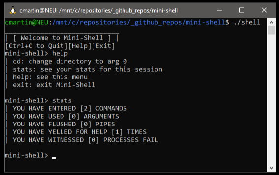

<div align="center">

  <h1>Mini-Shell</h1>
  
  <p>
    A trivial (and redundant!) shell implementation in C
  </p>

</div>

<div align="center">
  
</div>

# Table of Contents

- [About the Project](#about-the-project)
- [Tech Stack](#tech-stack)
- [Features](#features)
- [Usage](#usage)

## About the Project

`mini-shell` reinvents the wheel. Need a few more layers inside your shell environment? Say no more!

This project exists as an excuse to play with C and learn how systems APIs work in Linux.

### Tech Stack

[](#)

### Features

- Run standard Unix commands in yet-another-shell-inside-your-shell!
- Check your command execution statistics using `stats`

### Usage 

This project must be compiled in Linux/Unix due to the use of platform-specific headers. WSL is fine!

Compile the project using GCC:

```bash
  gcc shell.c -o shell
```

Run the project:

```bash
  ./shell
```
